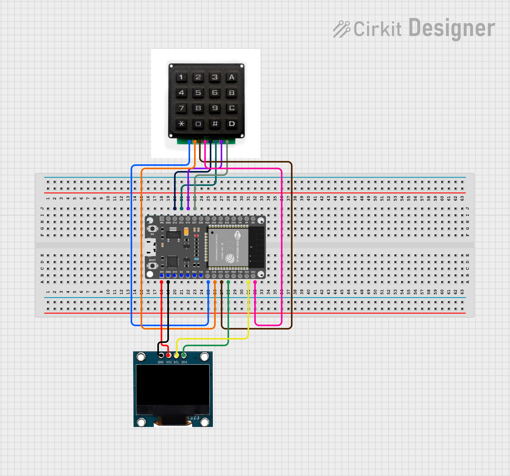

## One Time Door Entry Password Project by : Pierre khamis, Mahmoud Diab & Tasneem Nassar.
TBD

## Our Project in details :
TBD

## Folder description :
* ESP32: source code for the esp side (firmware).
* Documentation: wiring diagram + system diagram +  basic operating instructions
* Unit Tests: tests for individual hardware components (input / output devices)
* flutter_app : dart code for our Flutter app.
* Parameters: contains description of configurable parameters 

## Arduino/ESP32 libraries used in this project:
* Adafruit Keypad - version 1.3.2
* Time - version 1.6.1
* Adafruit GFX Library - version 1.11.9
* Adafruit BusIO - version 1.15.1
* Adafruit SSD1306 - version 2.5.9
* ArduinoJson - version 7.0.4

## Hardware used in this project:
* Esp32 CH9102 - number 2
* 1.3 inch MONOCHROME OLED display 128*64 with alternate address - number 2
* 4X4 matrix keypad - number 1

## Circuit diagrams:
### Keypad Unit Circuit:

### Oled unit circuit (Admin):
.png)

## Project Poster:
TBD

This project is part of ICST - The Interdisciplinary Center for Smart Technologies, Taub Faculty of Computer Science, Technion
https://icst.cs.technion.ac.il/